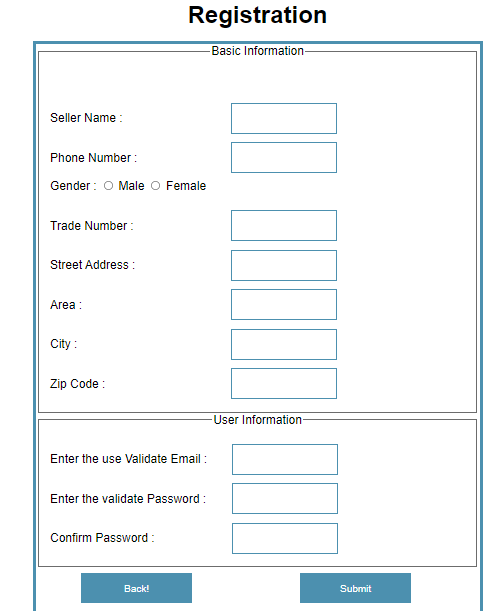
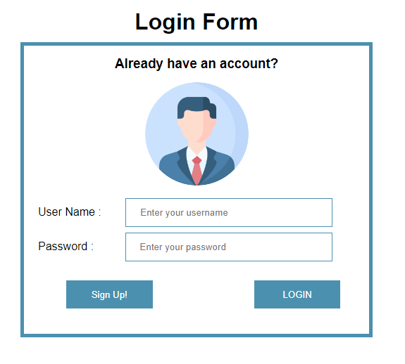
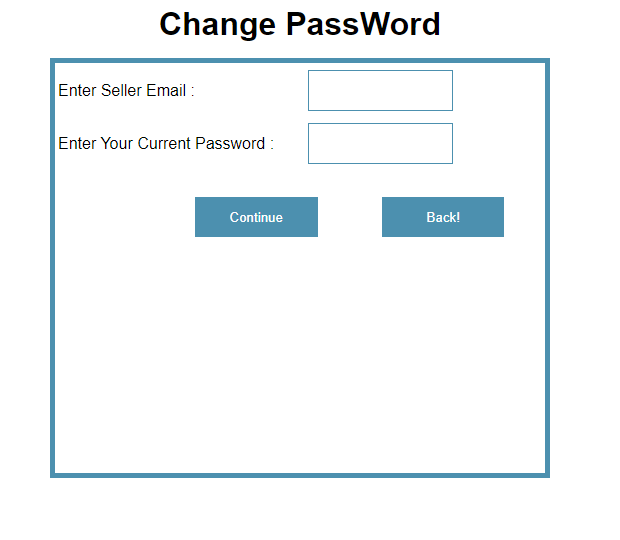

## This is our Registration Page
.
This project have 4 users. Each user has need to register before entering the system. So, the users are:
*   Admin.
*   Seller.
*   Buyer.
*   Agent.


To do registration users must be filled those **Required Information** otherwise a user can not be a valid user. Also, do not have the right to access the system.

**BASIC INFORMATION**

**The first field of registration is Seller name:** This text field receives only string data type.
  
  ```
<tr>
	<td><label for="sellerName">Seller Name : </label></td>
	<td><input type="text" id="sellerName" name="sname" value="<?php echo $sellerName ?>"> </td>
	<td><p><?php echo $sellerNameErr; ?></p><td>
	</tr>

```

**The Next field of registration is Phone Number:** This text field receives only integer data type.

```
<tr>
		<td><label for="sPhone">Phone Number : </label></td>
		<td><input type="text" name="sphone" id="sPhone" value="<?php echo $sPhone ?>"></td>
		<td><p><?php echo $sPhoneErr; ?></p> </td>
    </tr>
```

**The Next field of registration is Gender:** This radio field receives only string data type.

```
<tr>
       <td>
		<!-- Gender  -->
		<label>Gender : </label>
		<input type="Radio" name="gender" value="Male" id="male">
		<label for="male">Male</label>
		<input type="Radio" name="gender" value="Female" id="female">
		<label for="female">Female</label>
		<p><?php echo $GenderErr; ?></p>
		</td>
		</tr>
       
```

**The Next field of registration is Trade Number:** This text field receives only integer data type.

```
<tr>
       <td>  <label for="tradelicense">Trade Number : </label> </td>
	   <td>	<input type="text" name="tradelicense" id="tradelicense" value="<?php echo $tradelicense ?>"> </td>
		<td><p><?php echo $tradelicenseErr; ?></p>	</td>	
     </tr>
       
```

**The Next field of registration is Street Address:** This text field receives only integer data type.

```
<tr>
       <td> <label for="streetAddress">Street Address : </label> </td>
		<td><input type="text" name="streetaddress" id="streetAddress" value="<?php echo $streetAddress ?>"> </td>
		<td><p><?php echo $streetAddressErr; ?></p> </td>
		</tr>
```

**The Next field of registration is Area** This text field receives only string data type.

```
<tr>
       <td> <label for="sArea">Area : </label> </td>
		<td><input type="text" name="sarea" id="sArea" value="<?php echo $sArea ?>"> </td>
		<td><p><?php echo $sAreaErr; ?></p>	</td>
     </tr>
```

**The Next field of registration is City:** This text field receives only String data type.

```
<tr>
       <td> <label for="sCity">City : </label> </td>
		<td><input type="text" name="scity" id="sCity" value="<?php echo $sCity ?>"> </td>
		<td><p><?php echo $sCityErr; ?></p> </td>
		</tr>
```

**The Next field of registration is Zip Code:** This text field receives only integer data type.

```
<tr>
       <td> <label for="sZipCode">Zip Code : </label></td>
		<td><input type="text" name="szipcode" id="sZipCode" value="<?php echo $sZipCode ?>"> </td>
		<td><p><?php echo $sZipCodeErr; ?></p></td>
		</tr>
```

**USER INFORMATION**

**The Next field of registration is Enter Validate Email:** This text field receives string and integer data type.

```
<tr>
		<td><label for="Email"> Enter the use Validate Email  : </label></td>
		<td><input type="email" name="email" id="Email" value="<?php echo $Email ?>"></td>
		<td><p><?php echo $EmailErr; ?></p></td>
		</td>
		</tr>
```

**The Next field of registration is Enter Validate Password:** This password field receives string and integer data type.

```
<tr>
		<td><label for="password">Enter the validate Password : </label></td>
		<td><input type="password" name="pass" id="password" value="<?php echo $password ?>"></td>
		<td><p><?php echo $passwordErr; ?></p></td>
		</tr>
```

**The Next field of registration is Confirm Password:** This password field receives string and integer data type.

```
<tr>
		<td><label for="rpassword">Confirm Password : </label></td>
		<td><input type="password" name="rpass" id="rpassword" value="<?php echo $rPassword ?>"></td>
		<td><p><?php echo $rPsswordErr; ?></p></td>
		</tr>
```


Besides, we can found a **Back Button:** because if user wants to back the previous pages then he can easily back by using this back button.

```
<button type="button"> <a href="Login.php">Back!</a> </button>
```
Finally, **"SUBMIT"** user information. 

```
<input type="submit"  name="submit"  class="newbutton">	
```

### This is our registration interface outlook





## This is our Login Page

To do Login users must be filled those **Required Information** otherwise a user can not be enter to the system. Also, do not have the right to access the system.

**The first field of Login is User name:** This text field receives only string data type.
  
  ```
<h1 class="imgcontainer">Login Form</h1>
    
    <form name="LoginForm" action="" onsubmit="return validateForm()" method="POST"> 
    <h3 class="imgcontainer">Already have an account?</h3>
     <div class="imgcontainer">
    
    </div>
    <div>
    <label for="userName" class="label">User Name :</label>
	<input type="text" id="userName" name="username" placeholder="Enter your username" >
    </div>

```

**The Next field of Login is Password:** This text field receives only integer data type.

 
  ```
<div>
	<label for="Password" id="password" class="label">Password :</label>
    <input type="password" id="Password" name="password" placeholder="Enter your password" >
    </div>
    <div>

```

Next we can found a **Sign Up Button** if users not signup to the system then they use this button to sign up to the system and then they can be allowed to login to the system.

```
<div>

    <button type="button"> <a href="../view/Registration.php">Sign Up!</a> </button>
    
    </div>
```
Finally, **"SUBMIT"** user information. 

```
  <input id="submit" class="newbutton" name="submit" type="submit" value="LOGIN" >
```

### This is our Login interface outlook





## This is our Change Password Page

To do change password users must be filled those **Required Information** otherwise a user can not change his or her password. Also, do not have the right to access the system.


**INFORMATION that have to be Filled**

**The first field of Change Password is Seller Id:** This text field receives only string data type.

  ```
<tr>
     <!--  Id -->
       <td> <label for="sellerId">Enter Seller Email : </label></td>
		<td><input type="text" name="sid" id="sellerId" value="<?php echo $sellerId ?>"></td>
		<td><p><?php echo $sellerIdErr; ?></p></td>
		</tr>

```

**The Next field of Change Password is Current Password:** This text field receives string and integer data type.

```
 <!-- Current Password -->
	   <tr>
       <td> <label for="sPassword">Enter Your Current Password : </label></td>
		<td><input type="text" name="spass" id="sPassword" value="<?php echo $sPassword ?>"></td>
		<td><p><?php echo $sPasswordErr; ?></p></td>
		</tr>
```

Finally, **"SUBMIT"** user information. 

```

<input type="submit"  class= "newbutton" value="Continue" name= "button">

```

Besides, we can found a **Back Button:** because if user wants to back the previous pages then he can easily back by using this back button.

```
<button type="button"> <a href="Profile.php">Back!</a> </button>
```

### This is our Change Password interface outlook





## This is our Add Property Page

If a user wants to add property for selling purpose then the user must be  filled those **Required Information** otherwise a user can not add property information to the system.

**The first field of Add Property is Property name:** This text field receives only string data type.
  
  ```
 <tr>
	<td><label for="propertyName">Property Name : </label></td>
	<td><input type="text" id="propertyName" name="pname" value="<?php echo $propertyName ?>"></td>
	<td><p><?php echo $propertyNameErr; ?></p></td>
    </tr>

```

**The Next field of Add Property is Property Id:** This text field receives only integer data type.

```
<!-- propery Id -->
	 <tr>
       <td> <label for="pId">Property Id : </label></td>
		<td><input type="text" name="pid" id="pId" value="<?php echo $pId ?>"></td>
		<td><p><?php echo $pIdErr; ?></p></td>	
    </tr>
```

**The first field of Add Property is Location:** This text field receives only string data type.
  
  ```

<!-- Location  -->
	<tr>
		<td><label for="pLocation">Location : </label></td>
		<td><input type="text" name="plocation" id="pLocation" value="<?php echo $pLocation ?>"></td>
		<td><p><?php echo $pLocationErr; ?></p></td>
		</tr>
```

**The Next field of Add Property is Owner Name:** This text field receives only string data type.

```
<!-- Owner  -->
	<tr>
		<td><label for="pOwner">Owner Name : </label></td>
		<td><input type="text" name="powner" id="pOwner" value="<?php echo $pOwner ?>"></td>
		<td><p><?php echo $pOwnerErr; ?></p></td>
    </tr>
```

**The first field of Add Property is Property Price:** This text field receives only integer data type.
  
  ```
<!-- Property Price -->
	<tr>
        <td><label for="pPrice">Property Price : </label></td>
		<td><input type="text" name="pprice" id="pPrice" value="<?php echo $pPrice ?>"></td>
		<td><p><?php echo $pPriceErr; ?></p></td>	

	</tr>	

```

**The Next field of Add Property is Property Quantity:** This text field receives only integer data type.

```
<!-- Property Quantity -->
	<tr>
       <td> <label for="pQuantity">Property Quantity : </label></td>
		<td><input type="text" name="pquantity" id="pQuantity" value="<?php echo $pQuantity ?>"></td>
		<td><p><?php echo $pQuantityErr; ?></p></td>
		</tr>
```
**The first field of Add Property is attach Property Picture:** This text field receives only file data type.
  
  ```
<!-- Property Picture -->
	<tr>
        <td><label for="pPicture">Property Picture : </label></td>
		<td><input type="file" name="file" id="pPicture" value="<?php echo $pPicture ?>"></td>
		</tr

```

Finally, **"SUBMIT"** Property information. 

```

<input type="submit" name="submit" class="newbutton" >

```

Besides, we can found a **Back Button:** because if user wants to back the previous pages then he can easily back by using this back button.

```
<button type="button"> <a href="Profile.php">Back!</a> </button>
```

### This is our Add Property Information interface outlook
